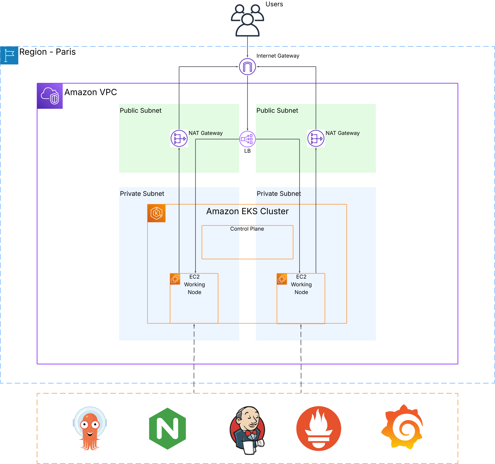

# EKS Scalable DevOps Platform

This project provides a scalable DevOps platform deployed on Amazon EKS. The platform includes Kubernetes cluster provisioning with Terraform, CI/CD pipeline setup with Jenkins, and monitoring with Prometheus and Grafana.

**Note: This project is still under active development. The README and documentation may not reflect the most current state of the project.**

## Project Overview

```
.
├── ansible
│   ├── playbooks
│   └── roles
├── assets
├── ci-cd
├── demo-app
│   └── src
├── kind
├── kubernetes
│   ├── argocd
│   │   └── dev
│   ├── helm-values
│   │   └── dev
│   ├── infrastucture
│   │   └── cert-manager
│   └── platform
│       ├── monitoring
│       └── networking
└── terraform
    ├── environnements
    │   ├── dev
    │   ├── prod
    │   └── staging
    └── modules
        ├── acm
        ├── argocd
        ├── dns-zone
        ├── eks
        ├── eks-addons
        ├── iam
        ├── loadbalancer
        ├── network
        ├── route53
        ├── secrets
        └── security
```

This project provides a comptlete DevOps platform with:

1. **Secure Kubernetes Infrastructure** on Amazon EKS with private nodes and controlled access
2. **GitOps-based Deployment** using ArgoCD for declarative application management
3. **Monitoring** with Prometheus and Grafana
4. **CI/CD Pipeline** with Jenkins for automated builds and tests
5. **Ingress Management** with NGINX for secure external access
6. **Autoscaling** for both infrastructure and applications

## Architecture Overview

A high-level overview of the architecture:

 

The platform consists of the following components:

### Infrastructure Layer

- **Amazon EKS**: Managed Kubernetes cluster with private worker nodes
- **VPC with Public/Private Subnets**: Network isolation for security
- **Application Load Balancer**: External traffic routing to services
- **NAT Gateways**: Secure outbound connectivity for worker nodes
- **IAM Roles & Policies**: Least privilege security model

### Platform Layer

- **ArgoCD**: GitOps deployment model with automatic synchronization
- **NGINX Ingress Controller**: Manages external access to services
- **Cluster Autoscaler**: Automatically scales the underlying infrastructure
- **Metrics Server**: Resource metrics for HPA and monitoring

### CI/CD & Monitoring Layer

- **Jenkins**: Automated build, test and deployment pipelines
- **Prometheus**: Metrics collection and alerting
- **Grafana**: Visualization and dashboards
- **AlertManager**: Alert notification and management

### Security Features

- **Private Kubernetes API**: Access limited to authorized IPs only
- **Private Worker Nodes**: No direct external access to nodes
- **Security Groups**: Fine-grained network access control
- **IAM Integration**: RBAC mapped to AWS IAM roles
- **Target Group Isolation**: Application traffic routed only to ingress controller ports
- **NodePort-based Ingress**: Controlled exposure of services

## Helm Chart Management

### Vendored Helm Charts

This project uses a "chart vendoring" approach where third-party Helm charts are copied into the repository to ensure:

1. **Version Control**: Exact versions of charts are maintained and tracked alongside the infrastructure code
2. **Customization**: Charts can be modified to suit specific project needs
3. **Stability**: Prevents unexpected changes from upstream chart repositories
4. **Offline Deployment**: Enables deployment in environments without direct Internet access

The vendored charts are located in the `helm-charts/` directory with corresponding values in `helm-values/<environment>/`.

### Third-Party Chart Attributions

The following third-party Helm charts are included in this repository:

- **ArgoCD**: [argoproj/argo-helm](https://github.com/argoproj/argo-helm) - Apache 2.0 License
- **Prometheus**: [prometheus-community/helm-charts](https://github.com/prometheus-community/helm-charts) - Apache 2.0 License
- **NGINX Ingress Controller**: [kubernetes/ingress-nginx](https://github.com/kubernetes/ingress-nginx) - Apache 2.0 License
- **Jenkins**: [jenkinsci/helm-charts](https://github.com/jenkinsci/helm-charts) - Apache 2.0 License
- **Metrics Server**: [kubernetes-sigs/metrics-server](https://github.com/kubernetes-sigs/metrics-server) - Apache 2.0 License
- **Cluster Autoscaler**: [kubernetes/autoscaler](https://github.com/kubernetes/autoscaler) - Apache 2.0 License

Each chart retains its original license within its directory. All modifications to the charts are documented in the respective chart's README file.

## Prerequisites

- **Amazon Web Services** account with billing enabled
- **AWS CLI** installed and configured
- **Terraform** installed on your machine
- **Kubernetes** CLI (kubectl) installed
- **Helm** installed for managing Kubernetes applications
- **Ansible** installed for configuration management

## Setup Instructions

### Step 1: Clone the repository

```bash
git clone git@github.com:Leomendoza13/eks-scalable-devops-platform.git
cd eks-scalable-devops-platform
```

### Step 2: Configure AWS CLI

1. Install AWS CLI if it's not already installed.
2. Authenticate with AWS:

```bash
aws configure
# Provide your AWS Access Key, Secret Key, and preferred region
```

Enter your AWS credentials when prompted.

### Step 3: Request an SSL Certificate in AWS Certificate Manager

Before deploying the infrastructure, you need to request an SSL certificate for your domain:

1. Go to AWS Certificate Manager in the AWS Console
2. Click "Request a certificate" and select "Request a public certificate"
3. Enter your domain name (e.g., `yourdomain.com`) and add a wildcard subdomain (e.g., `*.yourdomain.com`)
4. Choose DNS validation method (recommended)
5. Add tags if needed and click "Request"
6. Follow the DNS validation process:
   - In the certificate details, look for the CNAME records AWS provides
   - Add these CNAME records to your domain's DNS settings
   - Wait for validation to complete (can take up to 30 minutes)

Make note of the certificate ARN as you'll need it for the next step.

### Step 4: Deploy Infrastructure with Terraform

```bash
cd terraform/environnements/dev
terraform init
terraform apply
```

The infrastructure deployment will take approximately 10-15 minutes.

### Step 5: Configure ArgoCD Applications using Ansible

Once the infrastructure is ready, deploy ArgoCD applications:

```bash
helm install argocd argo/argo-cd --namespace argocd --create-namespace
```

This will:
- Deploy the ArgoCD application manifests
- Configure target groups for the load balancer
- Connect the worker nodes to the target groups

### Step 6: Configure DNS Records

Use the load balancer DNS name provided in the Ansible output to configure your DNS records:

```
Go to your domain service and create the following subdomains:
prometheus, jenkins, argocd, alertmanager, grafana
Link them to the load balancer using this DNS name:
<load-balancer-dns-name>
```

It will install all we need in the cluster.

### Step 7: Access the Services

Once DNS propagation is complete, you can access:

- ArgoCD: https://argocd.yourdomain.com
- Jenkins: https://jenkins.yourdomain.com
- Prometheus: https://prometheus.yourdomain.com
- Grafana: https://grafana.yourdomain.com
- AlertManager: https://alertmanager.yourdomain.com

For ArgoCD, get the initial admin password:

```bash
kubectl -n argocd get secret argocd-initial-admin-secret -o jsonpath="{.data.password}" | base64 -d
```

### Step 8: Deploy Your Image
#TODO

## CleanUp

To remove all deployed resources, run:

```bash
cd terraform/environnements/dev
terraform destroy
```

**Note**: This will completely remove all resources, including EKS cluster, worker nodes, and load balancers.

## Project Roadmap:

### Core Infrastructure ⚙️
- [x] VPC with public/private subnets
- [x] EKS cluster with private nodes
- [x] IAM roles and security groups
- [x] Load balancer and target groups
- [x] Terraform modular architecture
- [ ] Terraform state management in S3

### Platform Components 🧩
- [x] ArgoCD for GitOps deployment
- [x] NGINX Ingress Controller
- [x] Metrics Server
- [x] Cluster Autoscaler
- [x] Horizontal Pod Autoscaler (HPA)
- [ ] Vertical Pod Autoscaler (VPA)
- [x] Service discovery
- [ ] External DNS integration
- [x] Automated target group registration

### Application Development & Deployment 🚀
- [ ] Sample microservices application
- [ ] Containerized application template
- [ ] Dockerfile best practices
- [ ] Multi-stage Docker builds
- [ ] Container image optimization
- [ ] Private ECR repository setup
- [ ] Kubernetes deployment manifests
- [ ] Helm charts for applications
- [ ] ArgoCD application deployment
- [ ] Resource requests and limits
- [ ] Liveness and readiness probes

### Service Mesh & Networking 🕸️
- [ ] Istio service mesh implementation
- [ ] Traffic management with Istio
- [ ] mTLS for service-to-service communication
- [ ] Network policies for pod-to-pod traffic control
- [ ] Egress gateway for controlled external access

### CI/CD Pipeline 🔄
- [x] Jenkins deployment
- [x] Terraform validation pipeline
- [ ] Complete CI/CD workflow pipeline
- [ ] Automated testing
- [ ] Multi-environment deployment pipeline
- [ ] Integration tests

### Monitoring & Observability 📊
- [x] Prometheus for metrics
- [x] Grafana for visualization
- [x] AlertManager for alerts
- [x] Jenkins monitoring dashboard
- [ ] Custom Grafana dashboards for each major component/pod
- [ ] Distributed tracing implementation
- [ ] Custom alert definitions
- [ ] Health check endpoints and probes

### Security Features 🔒
- [x] Private Kubernetes API access
- [x] Security groups for network isolation
- [x] IAM role-based access
- [ ] Secret management with AWS Secrets Manager
- [ ] Cert-manager configuration
- [ ] Implementation of Pod Security Policies/Standards
- [ ] Image vulnerability scanning
- [ ] Runtime security monitoring

### Documentation & Maintenance 📝
- [x] Basic README with setup instructions
- [x] Architecture documentation
- [x] Deployment process documentation
- [ ] Component-specific documentation
- [ ] Troubleshooting guide
- [ ] Contribution guidelines
- [ ] Performance tuning recommendations

## License

This project is licensed under the MIT License. See the LICENSE file for details.

## Author

Developed by Léo Mendoza. Feel free to reach out for questions, contributions, or feedback at leo.mendoza.pro@outlook.com
